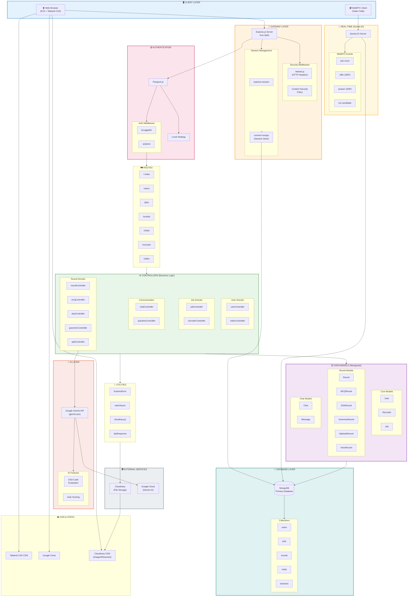

# InterViewXX - Complete System Architecture



---

## 🔄 Request Flow Summary

```
👤 User → 🌐 Browser → 🛡️ Express + Helmet → 🔐 Session → 👤 Passport Auth
    ↓
🛤️ Routes → ⚙️ Controllers → 📦 Models → 💾 MongoDB
    ↓
🤖 Gemini AI (for DSA) ←→ ☁️ Cloudinary (for files)
    ↓
📡 Socket.IO (real-time) → 📹 WebRTC (video calls)
```

---

## 📊 Technology Stack

| Layer | Technology |
|-------|------------|
| **Frontend** | EJS, Tailwind CSS, JavaScript |
| **Backend** | Node.js, Express 5.1 |
| **Database** | MongoDB, Mongoose 8 |
| **Auth** | Passport.js (Local Strategy) |
| **Sessions** | express-session + connect-mongo |
| **Real-time** | Socket.IO 4.8 |
| **Video** | WebRTC |
| **AI** | Google Gemini API |
| **Storage** | Cloudinary |
| **Security** | Helmet.js, bcrypt |

---

## 🎯 Key Data Flows

### 1️⃣ Job Application Flow
```
Candidate → Browse Jobs → Apply → Upload Resume (Cloudinary) → Save to MongoDB
```

### 2️⃣ Interview Round Flow
```
Start Round → Fetch Questions → Submit Answers → AI Evaluation (Gemini) → Score & Progress
```

### 3️⃣ Video Interview Flow
```
Join Room → Socket.IO Signaling → WebRTC P2P Connection → Live Video Stream
```

---

*InterViewXX - All-in-One Recruitment Platform*
