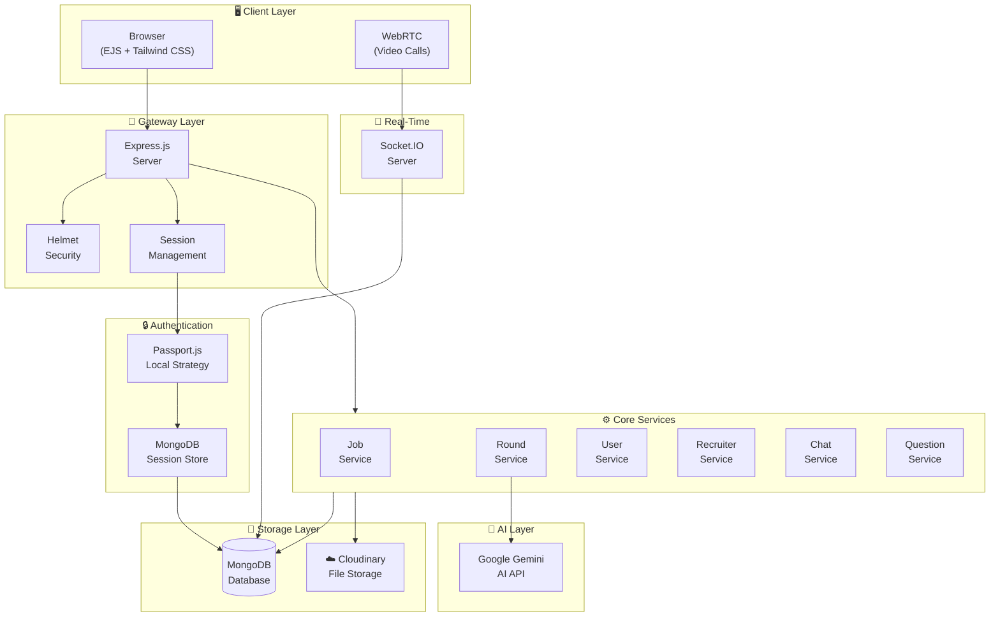
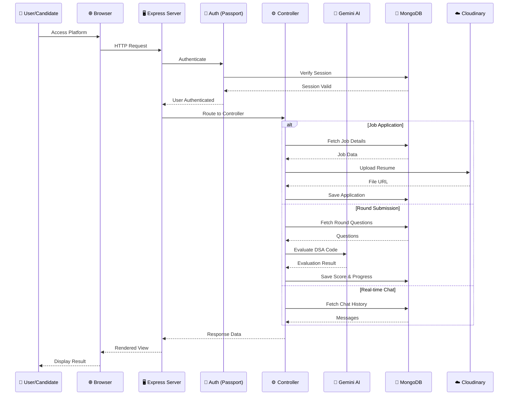
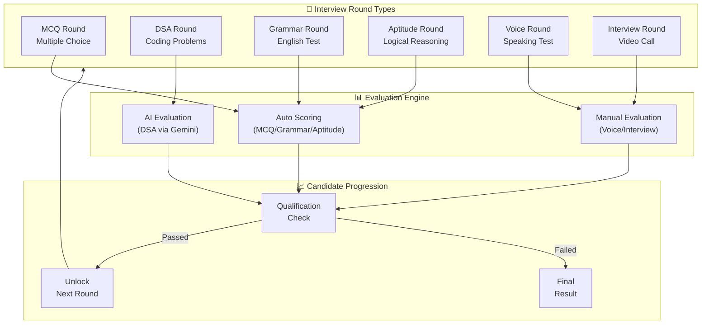
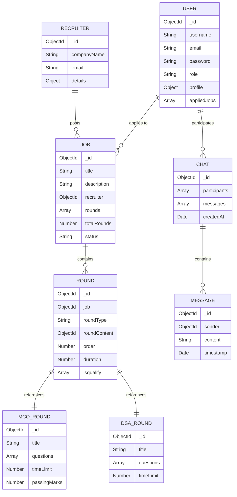
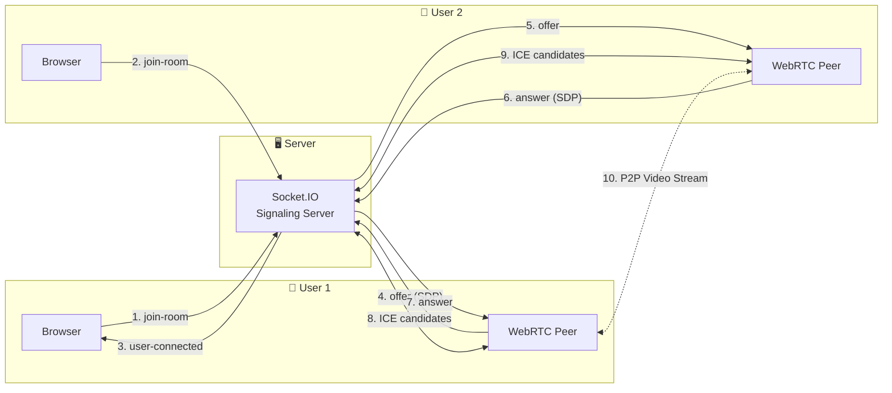
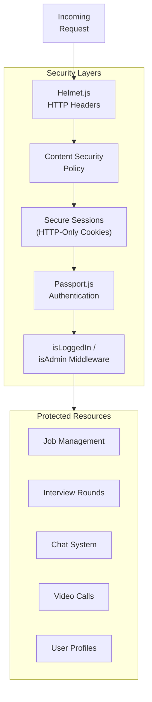
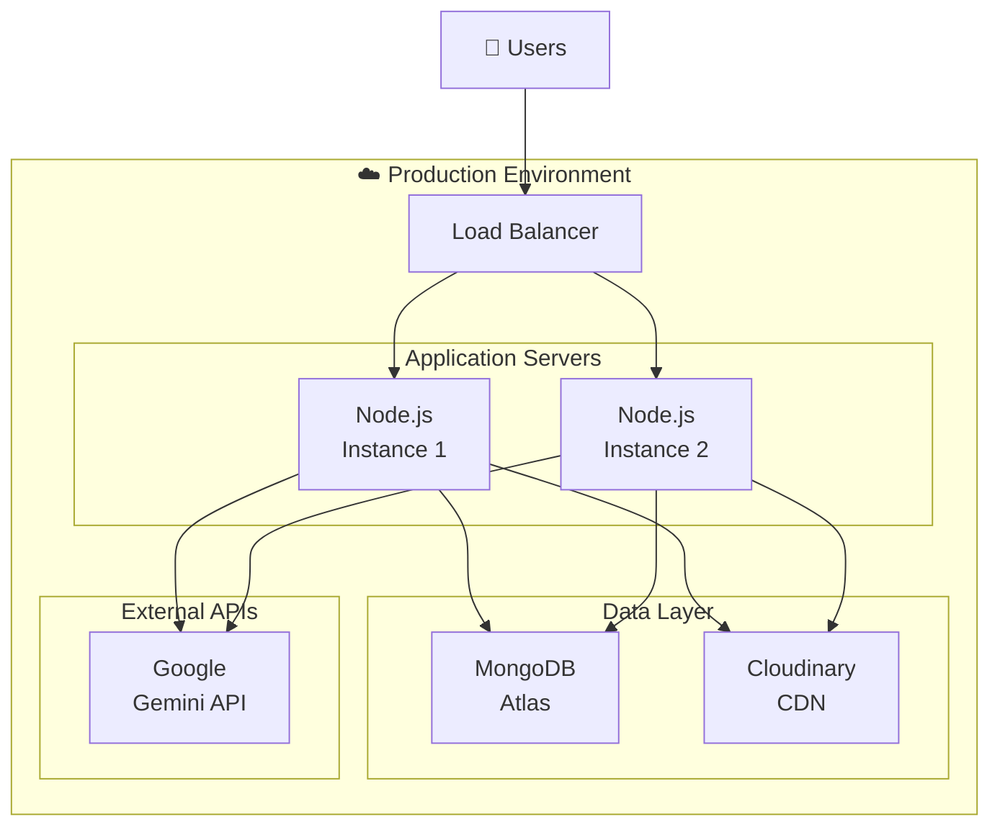

# InterViewXX - Architecture HLD (High-Level Design)

> **All-in-One Interview & Recruitment Platform**

---

## 📐 System Overview



---

## 🏗️ Detailed Component Architecture

```mermaid
flowchart LR
    subgraph Frontend["Frontend (EJS Templates)"]
        direction TB
        Pages["Pages"]
        Components["Components"]
        Static["Static Assets"]
        
        Pages --> IndexViews["Index Views"]
        Pages --> JobViews["Job Views"]
        Pages --> RoundViews["Round Views"]
        Pages --> UserViews["User Views"]
        Pages --> ChatViews["Chat Views"]
    end

    subgraph Backend["Backend (Express.js)"]
        direction TB
        Routes["Routes Layer"]
        Controllers["Controllers Layer"]
        Models["Models Layer"]
        Utils["Utilities"]
        Middlewares["Middlewares"]
    end

    subgraph Database["MongoDB Collections"]
        direction TB
        Users[(Users)]
        Jobs[(Jobs)]
        Rounds[(Rounds)]
        Questions[(Questions)]
        Chats[(Chats)]
        Messages[(Messages)]
        Attempts[(Round Attempts)]
    end

    Frontend --> Backend
    Backend --> Database
```



---

## 📊 Data Flow Architecture



---

## 🔄 Interview Round Flow



---

## 🗃️ Database Schema Overview



---

## 🔌 Real-Time Communication (WebRTC + Socket.IO)



---

## 🛡️ Security Architecture



---

## 📁 Project Structure

```
InterViewXX/
├── 📄 app.js                 # Main entry point
├── 📁 controllers/           # Business logic
│   ├── aptiController.js
│   ├── chatController.js
│   ├── dsaController.js
│   ├── grammerController.js
│   ├── indexController.js
│   ├── jobController.js
│   ├── mcqController.js
│   ├── questionController.js
│   ├── recruiterController.js
│   ├── roundController.js
│   └── userController.js
├── 📁 middlewares/           # Auth & file handling
│   ├── isAdmin.js
│   ├── isLoggedin.js
│   └── multer.middleware.js
├── 📁 models/                # MongoDB schemas
│   ├── UserSchema.js
│   ├── JobSchema.js
│   ├── RoundSchema.js
│   ├── MCQRound.js
│   ├── DSARound.js
│   ├── GrammarRound.js
│   ├── AptitudeRound.js
│   ├── VoiceRound.js
│   ├── InterviewRound.js
│   ├── ChatSchema.js
│   └── MessageSchema.js
├── 📁 routes/                # Express routes
│   ├── indexRoutes.js
│   ├── userRoutes.js
│   ├── jobRoutes.js
│   ├── roundRoutes.js
│   ├── mcqRoute.js
│   ├── dsaRoutes.js
│   ├── grammerRoutes.js
│   ├── aptiRoutes.js
│   ├── chatRoutes.js
│   └── recruiterRoutes.js
├── 📁 utils/                 # Helper utilities
│   ├── ExpressError.js
│   ├── catchAsync.js
│   ├── cloudinary.js
│   └── handlRound.js
├── 📁 views/                 # EJS templates
│   ├── 📁 includes/          # Partials
│   ├── 📁 jobs/              # Job pages
│   ├── 📁 rounds/            # Round pages
│   ├── 📁 users/             # User pages
│   └── 📁 chats/             # Chat pages
└── 📁 public/                # Static assets
    ├── 📁 css/
    ├── 📁 js/
    └── 📁 images/
```

---

## 🔧 Technology Stack

| Layer | Technology | Purpose |
|-------|------------|---------|
| **Frontend** | EJS + Tailwind CSS | Server-side rendering & styling |
| **Backend** | Node.js + Express 5 | REST API & routing |
| **Database** | MongoDB + Mongoose | Data persistence |
| **Auth** | Passport.js (Local) | User authentication |
| **Sessions** | connect-mongo | Session persistence |
| **Real-time** | Socket.IO | WebRTC signaling & chat |
| **AI** | Google Gemini API | Code evaluation |
| **Storage** | Cloudinary | File/resume uploads |
| **Security** | Helmet.js | HTTP security headers |

---

## 🚀 Deployment Architecture



---

## 📝 Key Features Summary

- **👤 Multi-role System**: Candidates, Recruiters, Admins
- **📋 Job Management**: Post, apply, track applications
- **🎯 Interview Rounds**: MCQ, DSA, Grammar, Aptitude, Voice, Video
- **🤖 AI-Powered**: Gemini AI for code evaluation
- **📹 Video Interviews**: Real-time WebRTC calls
- **💬 Live Chat**: Socket.IO messaging
- **☁️ Cloud Storage**: Cloudinary for file uploads
- **🔒 Secure**: Helmet.js, session management, Passport auth

---

*Generated for InterViewXX - All-in-One Recruitment Platform*
