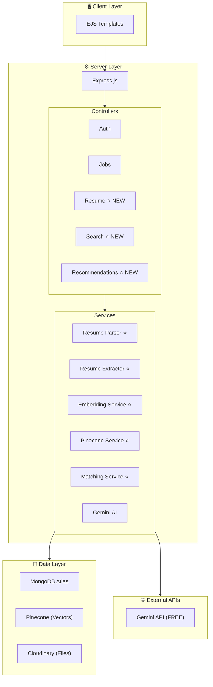
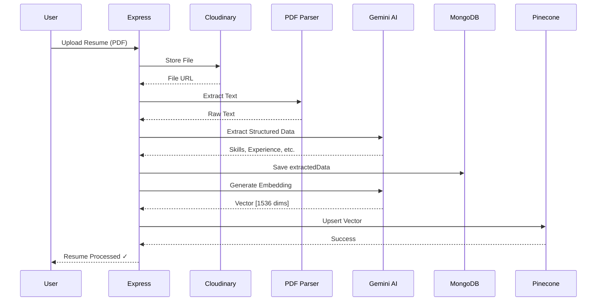
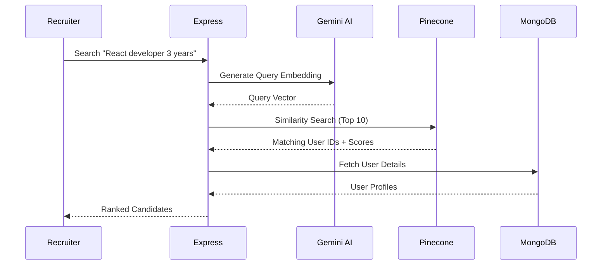

# InterViewXX - System Architecture

> **Zero-Cost Resume-Heavy Platform**

---

## High-Level Architecture



---

## Data Flow: Resume Upload & Processing



---

## Data Flow: Semantic Search



---

## Database Schema Updates

### MongoDB: User.extractedData

```javascript
{
  extractedData: {
    personalInfo: {
      name: String,
      email: String,
      phone: String,
      location: String,
      linkedIn: String,
      github: String
    },
    education: [{
      institution: String,
      degree: String,
      field: String,
      year: Number
    }],
    experience: [{
      company: String,
      title: String,
      duration: String,
      responsibilities: [String],
      technologies: [String]
    }],
    skills: [{
      name: String,
      category: String, // Technical, Soft, Language
      level: String     // Beginner, Intermediate, Advanced
    }],
    projects: [{
      name: String,
      description: String,
      technologies: [String]
    }]
  },
  vectorId: String  // Pinecone vector reference
}
```

### Pinecone: Vector Index

```javascript
{
  index: "interviewxx",
  namespace: "resumes",
  dimension: 768,  // Gemini embedding-001 dimension
  metric: "cosine",
  metadata: {
    userId: String,
    skills: [String],
    experienceYears: Number,
    location: String
  }
}
```

---

## Folder Structure (New Files)

```
InterViewXX/
├── controllers/
│   ├── resumeController.js    ⭐ NEW
│   ├── searchController.js    ⭐ NEW
│   └── recommendationController.js ⭐ NEW
├── routes/
│   ├── resumeRoutes.js        ⭐ NEW
│   ├── searchRoutes.js        ⭐ NEW
│   └── recommendationRoutes.js ⭐ NEW
├── utils/
│   ├── resumeParser.js        ⭐ NEW
│   ├── resumeExtractor.js     ⭐ NEW
│   ├── embeddingService.js    ⭐ NEW
│   ├── pineconeService.js     ⭐ NEW
│   └── matchingService.js     ⭐ NEW
├── models/
│   └── User.js                 (MODIFY - add extractedData)
└── tests/
    ├── resume.test.js          ⭐ NEW
    ├── search.test.js          ⭐ NEW
    └── matching.test.js        ⭐ NEW
```

---

*Last Updated: 2026-01-18*
