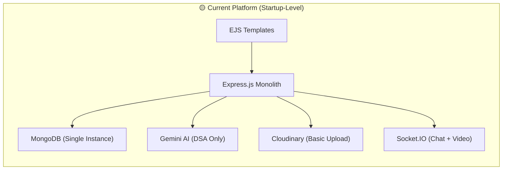
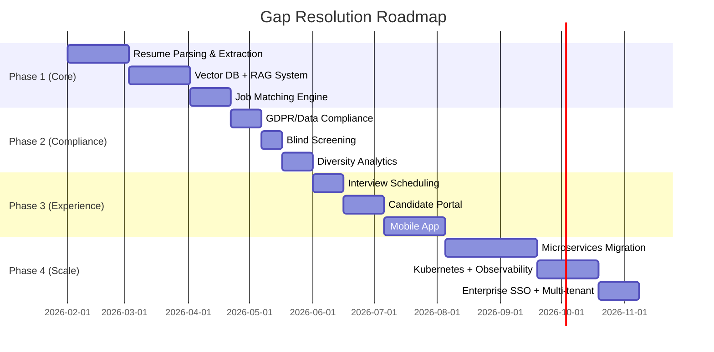
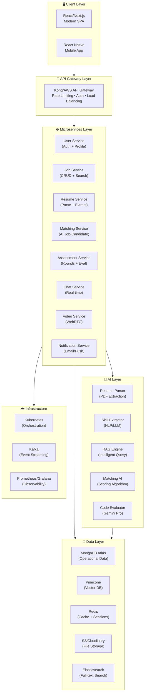
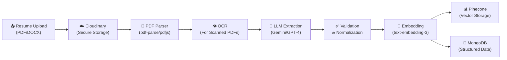
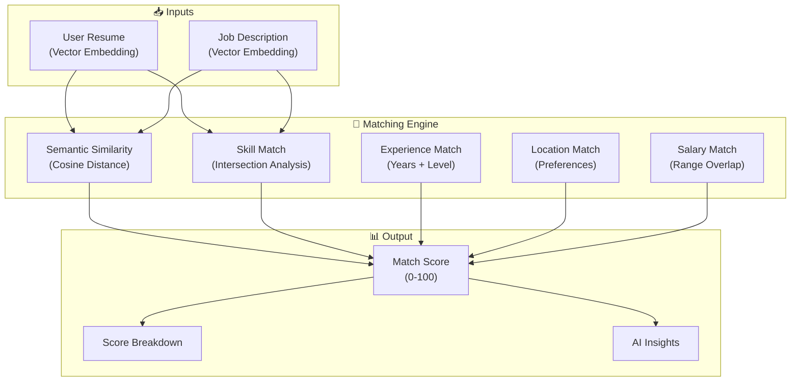
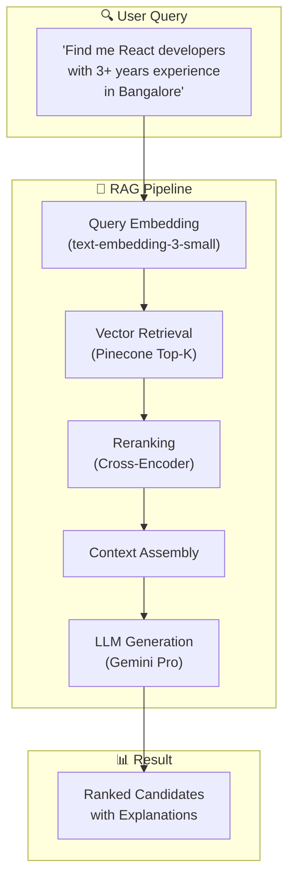
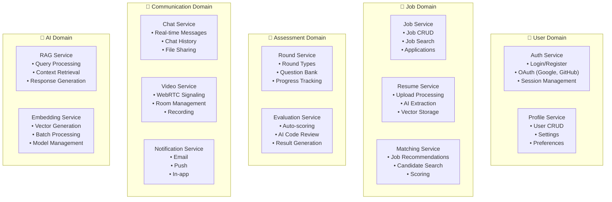
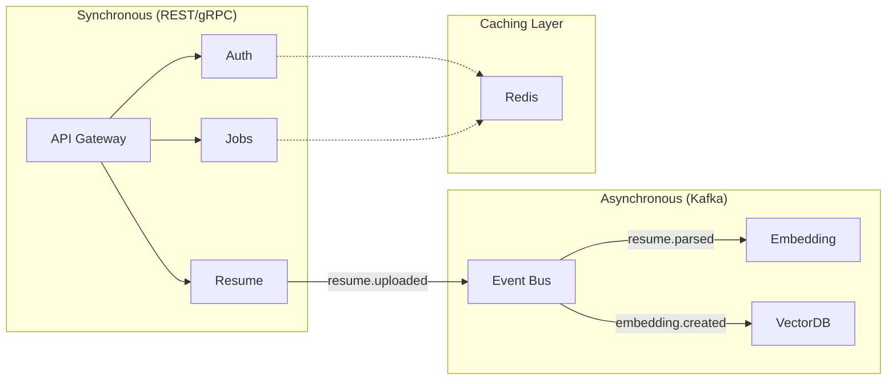

# InterViewXX → Google-Level Resume-Heavy Platform

> **Transformation Roadmap: From Startup MVP to Enterprise-Grade Recruitment Platform**  
> *Version 2.0 | January 2026*

---

## 📋 Table of Contents

1. [Current State Analysis](#current-state-analysis)
2. [Vision: Google-Level Platform](#vision-google-level-platform)
3. [Resume-Heavy Feature Suite](#resume-heavy-feature-suite)
4. [AI & RAG Architecture](#ai--rag-architecture)
5. [Enterprise Microservices Migration](#enterprise-microservices-migration)
6. [Implementation Phases](#implementation-phases)
7. [Tech Stack Evolution](#tech-stack-evolution)
8. [Competitive Differentiators](#competitive-differentiators)
9. [Decision Points for Review](#decision-points-for-review)

---

## 1. Current State Analysis

### 1.1 What We Have (Score: 50/100)



| Component | Current State | Enterprise Gap |
|-----------|--------------|----------------|
| **Resume Upload** | Basic Cloudinary storage | No parsing, no AI extraction |
| **Skills Matching** | Manual entry only | No semantic understanding |
| **Job Recommendations** | None | Critical missing feature |
| **AI Features** | DSA code evaluation only | Limited scope |
| **Architecture** | Monolith | Not scalable |
| **Search** | Basic MongoDB queries | No semantic/vector search |
| **Real-time** | Socket.IO ✅ | Good foundation |
| **Video Interview** | WebRTC ✅ | Good foundation |

### 1.2 Why Current Score is 50/100

**Strengths (What's Working):**
- ✅ Complete job posting and application workflow
- ✅ Multiple round types (MCQ, DSA, Grammar, Aptitude, Voice)
- ✅ Real-time chat via Socket.IO
- ✅ Video interviews via WebRTC
- ✅ Basic Gemini AI for code evaluation
- ✅ User profile with `resumeExtractedData` schema (ready for upgrade)

**Gaps (What's Missing for Google-Level):**

---

### 🔴 CORE GAPS (Your Original List)

| # | Gap | Impact |
|---|-----|--------|
| 1 | ❌ No automated PDF resume parsing/extraction | Can't auto-populate profiles |
| 2 | ❌ No vector database for semantic search | Limited to keyword matching |
| 3 | ❌ No RAG system for intelligent query handling | No conversational AI |
| 4 | ❌ No skill-based job recommendations | Users find jobs manually |
| 5 | ❌ No resume-job matching score | No fit assessment |
| 6 | ❌ Monolithic architecture (not horizontally scalable) | Can't scale to thousands |
| 7 | ❌ No MLOps pipeline for AI models | No model versioning/monitoring |
| 8 | ❌ No observability/SRE practices | No visibility into system health |
| 9 | ❌ No microservices for independent scaling | All-or-nothing scaling |

---

### 🟠 AI/ML ENHANCEMENT GAPS

| # | Gap | What Enterprise Platforms Have |
|---|-----|------------------------------|
| 10 | ❌ No AI-powered job description generator | Greenhouse, Lever auto-generate JDs |
| 11 | ❌ No predictive hiring analytics | Predict interview success, time-to-hire |
| 12 | ❌ No AI personality profiling | Pymetrics-style behavioral assessment |
| 13 | ❌ No AI-powered interview question generator | Generate role-specific questions |
| 14 | ❌ No candidate sentiment analysis | Analyze video interview expressions |
| 15 | ❌ No AI resume scoring/ranking | Automatically rank applicants |
| 16 | ❌ No candidate success prediction | ML model for hire quality prediction |
| 17 | ❌ No automated code plagiarism detection | For DSA/coding rounds |
| 18 | ❌ No multi-language support | Parse resumes in Hindi, Spanish, etc. |

---

### 🟡 COMPLIANCE & ETHICS GAPS

| # | Gap | Why It Matters |
|---|-----|---------------|
| 19 | ❌ No blind resume screening | Can't remove bias (name, photo, age) |
| 20 | ❌ No diversity analytics dashboard | Can't track DEI metrics |
| 21 | ❌ No GDPR/CCPA compliance features | Data retention, consent, right to forget |
| 22 | ❌ No anti-bias AI auditing | No fairness checks on AI decisions |
| 23 | ❌ No EEO (Equal Employment) reporting | Required for US companies |
| 24 | ❌ No data anonymization pipeline | For analytics without PII exposure |
| 25 | ❌ No audit logging for compliance | Who accessed what, when |

---

### 🟢 CANDIDATE EXPERIENCE GAPS

| # | Gap | What Top Platforms Offer |
|---|-----|-------------------------|
| 26 | ❌ No mobile app | React Native or Flutter app |
| 27 | ❌ No one-click apply (LinkedIn/Indeed) | Social login + resume import |
| 28 | ❌ No self-service interview scheduling | Calendly-style scheduling |
| 29 | ❌ No automated status updates | Candidates don't know where they stand |
| 30 | ❌ No personalized career portal | Candidate dashboard with recommendations |
| 31 | ❌ No gamified assessments | Coding games, personality quizzes |
| 32 | ❌ No interview preparation resources | AI mock interviews, tips |
| 33 | ❌ No feedback mechanism | Candidate NPS/satisfaction surveys |
| 34 | ❌ No branded career pages | Customizable company career sites |

---

### 🔵 RECRUITER PRODUCTIVITY GAPS

| # | Gap | What Enterprise Platforms Have |
|---|-----|------------------------------|
| 35 | ❌ No candidate CRM | Track relationship over time |
| 36 | ❌ No talent pool/pipeline | Save candidates for future roles |
| 37 | ❌ No automated sourcing | AI finds candidates on LinkedIn/GitHub |
| 38 | ❌ No bulk actions | Mass email, mass status update |
| 39 | ❌ No interview scorecard templates | Structured evaluation forms |
| 40 | ❌ No hiring team collaboration | Comments, mentions, @tagging |
| 41 | ❌ No offer letter generation | Template-based offer creation |
| 42 | ❌ No background check integration | Checkr, HireRight integrations |
| 43 | ❌ No referral tracking system | Employee referral program |

---

### 🟣 ANALYTICS & REPORTING GAPS

| # | Gap | What Data-Driven Platforms Need |
|---|-----|-------------------------------|
| 44 | ❌ No hiring funnel analytics | Conversion rates at each stage |
| 45 | ❌ No time-to-hire metrics | Average days to fill positions |
| 46 | ❌ No cost-per-hire tracking | ROI on job boards, sourcing |
| 47 | ❌ No source effectiveness analytics | Which channels bring best candidates |
| 48 | ❌ No interviewer performance metrics | Who's best at evaluating candidates |
| 49 | ❌ No custom report builder | Drag-and-drop report creation |
| 50 | ❌ No real-time dashboards | Live hiring metrics |
| 51 | ❌ No A/B testing for job posts | Test which JD formats work better |

---

### 🟤 ADVANCED ASSESSMENT GAPS

| # | Gap | What Makes Assessment Best-in-Class |
|---|-----|-----------------------------------|
| 52 | ❌ No live collaborative coding | CodePair-style shared IDE |
| 53 | ❌ No whiteboard for system design | Draw.io/Excalidraw integration |
| 54 | ❌ No take-home project support | Assign and track multi-day projects |
| 55 | ❌ No proctoring for remote tests | Prevent cheating (camera, screen) |
| 56 | ❌ No adaptive testing | Adjust difficulty based on performance |
| 57 | ❌ No interview recording & playback | Record video interviews for review |
| 58 | ❌ No AI code review for submissions | Beyond just pass/fail |
| 59 | ❌ No skill verification badges | Certify skills like HackerRank |

---

### ⚫ INFRASTRUCTURE & DEVOPS GAPS

| # | Gap | What Production Systems Need |
|---|-----|----------------------------|
| 60 | ❌ No rate limiting | DDoS and abuse protection |
| 61 | ❌ No API versioning | Can't evolve without breaking clients |
| 62 | ❌ No webhook/integration system | Third-party app connections |
| 63 | ❌ No multi-tenant support | Can't serve multiple companies |
| 64 | ❌ No SSO/SAML support | Enterprise authentication |
| 65 | ❌ No staging/production environments | No safe testing ground |
| 66 | ❌ No automated database backups | Data loss risk |
| 67 | ❌ No CDN for static assets | Slow global performance |
| 68 | ❌ No blue-green deployments | Zero-downtime updates |

---

### 📊 Gap Summary

| Category | Gaps Count | Priority |
|----------|-----------|----------|
| 🔴 Core (Your List) | 9 | **P0 - Critical** |
| 🟠 AI/ML Enhancement | 9 | **P1 - High** |
| 🟡 Compliance & Ethics | 7 | **P1 - High** |
| 🟢 Candidate Experience | 9 | **P2 - Medium** |
| 🔵 Recruiter Productivity | 9 | **P2 - Medium** |
| 🟣 Analytics & Reporting | 8 | **P2 - Medium** |
| 🟤 Advanced Assessment | 8 | **P3 - Nice-to-Have** |
| ⚫ Infrastructure & DevOps | 9 | **P1 - High** |
| **TOTAL** | **68 Gaps** | |

---

### 🎯 Recommended Priority Order



---

## 2. Vision: Google-Level Platform

### 2.1 Target Architecture (Score: 100/100)



### 2.2 What Makes It "Google-Level"

| Layer | Google-Level Practice |
|-------|----------------------|
| **Architecture** | Microservices with clear domain boundaries |
| **AI/ML** | RAG system with vector embeddings, MLOps pipeline |
| **Data** | Polyglot persistence (MongoDB + Redis + Vector DB) |
| **Search** | Semantic search with Pinecone/Weaviate + BM25 hybrid |
| **Reliability** | SRE practices, SLOs, error budgets, observability |
| **Scalability** | Kubernetes, horizontal pod autoscaling |
| **Real-time** | Event-driven architecture with Kafka |
| **DevOps** | CI/CD, GitOps, automated testing |

---

## 3. Resume-Heavy Feature Suite

### 3.1 Intelligent Resume Processing Pipeline



### 3.2 Data Extraction Schema

```javascript
// Enhanced User Resume Schema
const resumeSchema = {
  // File Storage
  resumeFile: {
    url: String,              // Cloudinary URL
    filename: String,         // Public ID
    originalName: String,     // User's filename
    uploadedAt: Date,
    fileSize: Number,
    mimeType: String
  },
  
  // Raw Extracted Text (for search indexing)
  rawText: String,
  
  // Structured Extracted Data (AI-parsed)
  extractedData: {
    // Personal Info
    personalInfo: {
      name: String,
      email: String,
      phone: String,
      location: {
        city: String,
        state: String,
        country: String
      },
      linkedIn: String,
      github: String,
      portfolio: String
    },
    
    // Education
    education: [{
      institution: String,
      degree: String,
      field: String,
      startDate: Date,
      endDate: Date,
      gpa: Number,
      achievements: [String]
    }],
    
    // Work Experience
    experience: [{
      company: String,
      title: String,
      location: String,
      type: { type: String, enum: ['Full-time', 'Part-time', 'Contract', 'Internship'] },
      mode: { type: String, enum: ['Remote', 'On-site', 'Hybrid'] },
      startDate: Date,
      endDate: Date,
      current: Boolean,
      responsibilities: [String],
      achievements: [String],
      technologies: [String]
    }],
    
    // Skills (with AI-inferred levels)
    skills: [{
      name: String,
      category: { type: String, enum: ['Technical', 'Soft', 'Language', 'Domain'] },
      level: { type: String, enum: ['Beginner', 'Intermediate', 'Advanced', 'Expert'] },
      yearsOfExperience: Number,
      lastUsed: Date,
      endorsements: Number
    }],
    
    // Projects
    projects: [{
      name: String,
      description: String,
      technologies: [String],
      url: String,
      githubUrl: String,
      role: String,
      impact: String
    }],
    
    // Certifications
    certifications: [{
      name: String,
      issuer: String,
      dateIssued: Date,
      expiryDate: Date,
      credentialUrl: String,
      credentialId: String
    }],
    
    // Languages
    languages: [{
      name: String,
      proficiency: { type: String, enum: ['Native', 'Fluent', 'Professional', 'Conversational', 'Basic'] }
    }]
  },
  
  // AI-Generated Metadata
  aiMetadata: {
    parseConfidence: Number,      // 0-100 parsing accuracy
    extractedAt: Date,
    modelUsed: String,
    summary: String,              // AI-generated career summary
    seniorityLevel: String,       // Junior/Mid/Senior/Lead/Executive
    industryFit: [String],        // Predicted industry matches
    roleMatches: [String],        // Predicted role matches
    skillsGap: [{
      skill: String,
      recommendedFor: [String]    // Job types that need this skill
    }]
  },
  
  // Vector Embedding Reference
  vectorEmbedding: {
    id: String,                   // Pinecone vector ID
    namespace: String,
    createdAt: Date
  }
};
```

### 3.3 AI-Powered Job Matching



**Matching Algorithm (Weighted Scoring):**

```javascript
const calculateMatchScore = (resume, job) => {
  const weights = {
    semanticSimilarity: 0.30,   // Vector cosine similarity
    skillsMatch: 0.35,          // Required vs. candidate skills
    experienceMatch: 0.15,      // Years of experience
    educationMatch: 0.10,       // Degree requirements
    locationMatch: 0.05,        // Location preferences
    salaryMatch: 0.05           // Salary range alignment
  };
  
  // Each component returns 0-1 score
  const scores = {
    semanticSimilarity: await getCosineSimilarity(resume.embedding, job.embedding),
    skillsMatch: calculateSkillsOverlap(resume.skills, job.requiredSkills),
    experienceMatch: matchExperience(resume.yearsOfExperience, job.experienceRequired),
    educationMatch: matchEducation(resume.education, job.educationRequired),
    locationMatch: matchLocation(resume.preferences, job.location),
    salaryMatch: matchSalaryRange(resume.expectedSalary, job.salaryRange)
  };
  
  // Weighted average
  return Object.keys(weights).reduce((total, key) => 
    total + (weights[key] * scores[key] * 100), 0
  );
};
```

---

## 4. AI & RAG Architecture

### 4.1 RAG System Design



### 4.2 Vector Database Strategy

**Technology: Pinecone (Serverless)**

```javascript
// Pinecone Index Configuration
const indexConfig = {
  name: 'interviewxx-production',
  dimension: 1536,  // OpenAI embedding dimensions
  metric: 'cosine',
  
  // Namespaces for data isolation
  namespaces: {
    'resumes': 'User resume embeddings',
    'jobs': 'Job description embeddings',
    'skills': 'Skills taxonomy embeddings',
    'companies': 'Company profile embeddings'
  },
  
  // Metadata schema for filtering
  metadata: {
    userId: 'string',
    skills: 'string[]',
    experienceYears: 'number',
    location: 'string',
    seniorityLevel: 'string',
    lastActive: 'date'
  }
};
```

### 4.3 Embedding Strategy

| Content Type | Model | Dimensions | Use Case |
|-------------|-------|------------|----------|
| Resume Full Text | `text-embedding-3-small` | 1536 | Semantic search |
| Job Description | `text-embedding-3-small` | 1536 | Job matching |
| Skills | `text-embedding-3-small` | 1536 | Skill similarity |
| Questions | `text-embedding-3-small` | 1536 | RAG retrieval |

### 4.4 Token Optimization & Cost Management

```javascript
// Cost-aware embedding strategy
const embeddingConfig = {
  // Use smaller model for cost savings (10x cheaper)
  model: 'text-embedding-3-small',  // vs text-embedding-3-large
  
  // Chunk strategy for long resumes
  chunking: {
    maxTokens: 512,
    overlap: 50,
    strategy: 'semantic'  // vs fixed-size
  },
  
  // Caching to reduce API calls
  cache: {
    ttl: 86400 * 30,  // 30 days
    storage: 'Redis'
  },
  
  // Batch processing for efficiency
  batch: {
    maxSize: 100,
    delayMs: 100
  }
};
```

---

## 5. Enterprise Microservices Migration

### 5.1 Service Decomposition



### 5.2 Inter-Service Communication



### 5.3 Event-Driven Architecture

```javascript
// Event Schema Examples
const events = {
  'resume.uploaded': {
    userId: 'string',
    resumeId: 'string',
    cloudinaryUrl: 'string',
    timestamp: 'date'
  },
  
  'resume.parsed': {
    userId: 'string',
    resumeId: 'string',
    extractedData: 'object',
    confidence: 'number'
  },
  
  'embedding.created': {
    userId: 'string',
    resumeId: 'string',
    vectorId: 'string',
    namespace: 'string'
  },
  
  'job.matched': {
    userId: 'string',
    jobId: 'string',
    matchScore: 'number',
    timestamp: 'date'
  }
};
```

---

## 6. Implementation Phases

### Phase 1: Resume Intelligence (Weeks 1-4)

> **Goal:** Implement complete resume processing pipeline

| Week | Deliverables |
|------|-------------|
| **1** | PDF parsing service with `pdf-parse` + Tesseract OCR for scanned PDFs |
| **2** | AI extraction using Gemini Pro with structured output schema |
| **3** | Cloudinary integration with PDF preview + secure storage |
| **4** | MongoDB schema update + migration scripts |

**Key Deliverables:**
- [ ] `ResumeService` with upload, parse, extract endpoints
- [ ] Gemini Pro prompt engineering for resume extraction
- [ ] Enhanced `UserSchema` with full `extractedData`
- [ ] Resume preview UI with edit capabilities

### Phase 2: Vector Search & RAG (Weeks 5-8)

> **Goal:** Implement semantic search with Pinecone + RAG

| Week | Deliverables |
|------|-------------|
| **5** | Pinecone index setup with namespace strategy |
| **6** | Embedding service with OpenAI integration + caching |
| **7** | Vector upsert for resumes and jobs |
| **8** | RAG query engine for intelligent search |

**Key Deliverables:**
- [ ] Pinecone index with `resumes` and `jobs` namespaces
- [ ] `EmbeddingService` with batch processing
- [ ] `RAGService` for query handling
- [ ] Hybrid search (vector + keyword)

### Phase 3: AI Matching Engine (Weeks 9-12)

> **Goal:** Skill-based job recommendations with scoring

| Week | Deliverables |
|------|-------------|
| **9** | Matching algorithm with weighted scoring |
| **10** | Job recommendations feed for candidates |
| **11** | Candidate ranking for recruiters |
| **12** | AI insights and match explanations |

**Key Deliverables:**
- [ ] `MatchingService` with scoring algorithm
- [ ] Personalized job feed based on resume
- [ ] Recruiter dashboard with ranked candidates
- [ ] "Why this match?" AI explanations

### Phase 4: Architecture Modernization (Weeks 13-20)

> **Goal:** Migrate to microservices architecture

| Week | Deliverables |
|------|-------------|
| **13-14** | Docker containerization of all services |
| **15-16** | Kubernetes deployment on GKE/EKS |
| **17-18** | Event-driven architecture with Kafka |
| **19-20** | Observability setup (Prometheus, Grafana, ELK) |

**Key Deliverables:**
- [ ] Dockerized microservices
- [ ] Kubernetes manifests with Helm charts
- [ ] CI/CD pipeline (GitHub Actions → GKE)
- [ ] Full observability stack

### Phase 5: Production Excellence (Weeks 21-24)

> **Goal:** Achieve Google-level reliability

| Week | Deliverables |
|------|-------------|
| **21** | Load testing with k6 |
| **22** | SLO definition and error budgets |
| **23** | Security audit and penetration testing |
| **24** | Performance optimization and caching |

**Key Deliverables:**
- [ ] <200ms API response time (P95)
- [ ] 99.9% uptime SLO
- [ ] Zero critical vulnerabilities
- [ ] Autoscaling configuration

---

## 7. Tech Stack Evolution

### 7.1 Current → Target Stack

| Layer | Current | Target | Rationale |
|-------|---------|--------|-----------|
| **Frontend** | EJS Templates | Next.js 14 (React) | Modern SPA, SSR, better DX |
| **Backend** | Express Monolith | Node.js Microservices | Scalability, isolation |
| **Database** | MongoDB (Single) | MongoDB Atlas (Sharded) | Production-grade |
| **Search** | MongoDB Queries | Pinecone + Elasticsearch | Semantic + Full-text |
| **Cache** | None | Redis Cluster | Performance, sessions |
| **Queue** | None | Kafka | Event-driven, decoupling |
| **AI** | Gemini (DSA only) | Gemini + OpenAI Embeddings | Full AI suite |
| **Infra** | Local/Basic | Kubernetes (GKE/EKS) | Orchestration, scaling |
| **Storage** | Cloudinary | Cloudinary + S3 | Large file handling |
| **Auth** | Passport.js | Passport + OAuth2 | Social login |

### 7.2 New Dependencies

```json
{
  "resume-processing": {
    "pdf-parse": "^1.1.1",
    "tesseract.js": "^5.0.0",
    "mammoth": "^1.6.0"
  },
  "vector-database": {
    "@pinecone-database/pinecone": "^2.0.0"
  },
  "embeddings": {
    "openai": "^4.0.0",
    "@langchain/core": "^0.1.0"
  },
  "caching": {
    "ioredis": "^5.3.0"
  },
  "messaging": {
    "kafkajs": "^2.2.0"
  },
  "observability": {
    "prom-client": "^15.0.0",
    "winston": "^3.11.0"
  }
}
```

---

## 8. Competitive Differentiators

### 8.1 vs. LinkedIn Talent Solutions

| Feature | LinkedIn | InterViewXX (Proposed) |
|---------|----------|----------------------|
| Resume Parsing | Basic | Deep AI extraction with skill inference |
| Job Matching | Good | Better (hybrid vector + skill-based) |
| Assessment | None | Built-in MCQ, DSA, Video rounds |
| Video Interview | None | Native WebRTC |
| Real-time Chat | Messages | Full chat + collaboration |
| Pricing | Expensive | Competitive |

### 8.2 vs. Greenhouse/Lever (ATS Leaders)

| Feature | Greenhouse/Lever | InterViewXX (Proposed) |
|---------|-----------------|----------------------|
| Resume Parsing | External API | Built-in + AI |
| Assessment | Limited | Full suite (6 round types) |
| Video Interview | Integration | Native |
| AI Matching | Basic | Advanced RAG + Vector |
| Open Source | No | Potential |

### 8.3 Unique Value Propositions

1. **All-in-One Platform**: No need for separate ATS + video + assessment tools
2. **AI-Native**: Not retrofitted AI, built from ground up
3. **Resume-Heavy**: Deep parsing, skill inference, career trajectory analysis
4. **Real-time Everything**: Chat, video, collaborative coding
5. **Modern Architecture**: Cloud-native, scalable, observable

---

## 9. Decision Points for Review

> [!IMPORTANT]
> **Please review these critical decisions before proceeding:**

### 9.1 Technology Choices

| Decision | Option A | Option B | Recommendation |
|----------|----------|----------|----------------|
| **Vector DB** | Pinecone (Managed) | Weaviate (Self-host) | **Pinecone** - Lower ops overhead |
| **Embedding Model** | OpenAI text-embedding-3 | Gemini Embeddings | **OpenAI** - Better ecosystem |
| **Frontend Migration** | Next.js | Keep EJS (for now) | **Phase later** - Focus on backend first |
| **Message Queue** | Kafka | RabbitMQ | **Kafka** - Better for high volume |
| **Kubernetes** | GKE | EKS | Depends on preference |

### 9.2 Architecture Questions

1. **Monolith vs Microservices Timeline**: Should we start microservices immediately or stabilize resume features first in monolith?
   - **Recommendation**: Stabilize resume features first (Phases 1-3), then migrate (Phase 4)

2. **Frontend Strategy**: Should we migrate to Next.js now or focus purely on backend?
   - **Recommendation**: Keep EJS for now, migrate in future phase

3. **Self-hosted vs Managed Services**: How much operational overhead are we willing to take?
   - **Recommendation**: Prefer managed (Pinecone, MongoDB Atlas, managed K8s) for speed

### 9.3 Budget Considerations

| Service | Monthly Cost (Estimate) |
|---------|------------------------|
| Pinecone (Serverless) | $70-200 (based on usage) |
| OpenAI Embeddings | $20-100 |
| MongoDB Atlas (M10) | $57 |
| Vercel/Cloud Run | $20-100 |
| Kafka (Confluent) | $0-200 |
| **Total Estimate** | **$150-600/month** |

### 9.4 Questions for You

1. **Priority**: Should we prioritize resume parsing first, or job recommendations first?
2. **Scope**: Do you want to include frontend migration to Next.js in this plan?
3. **Timeline**: Is 24 weeks realistic, or do you need a faster MVP?
4. **Budget**: Are the estimated costs acceptable?
5. **Microservices**: Are you comfortable with Kubernetes, or prefer simpler deployment?

---

## Next Steps

> [!TIP]
> **Once approved, I will:**
> 1. Create `architecture.md` with detailed system diagrams
> 2. Create `tech-stack.md` with complete dependency specifications
> 3. Create `progress.md` to track implementation
> 4. Begin Phase 1: Resume Intelligence

---

*InterViewXX v2.0 - Transforming to Google-Level Platform*
